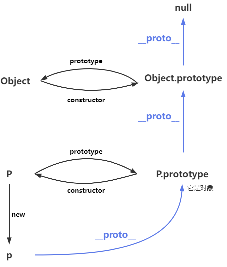
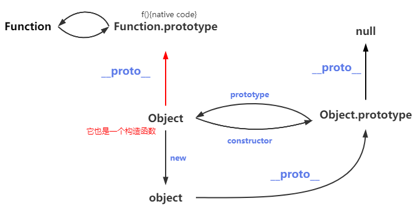
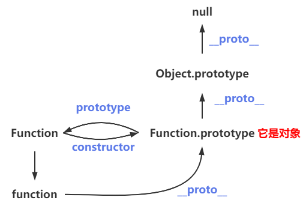
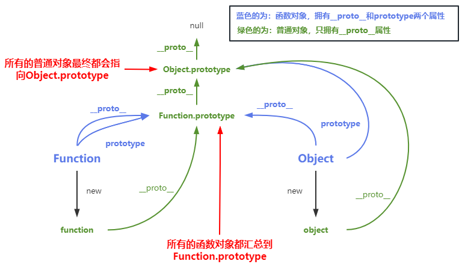
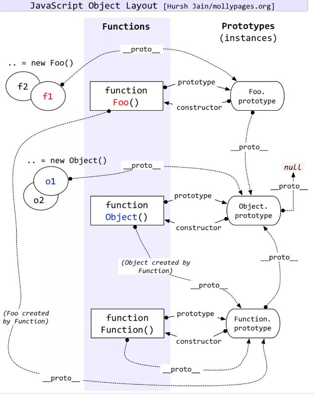

## 原型和原型链

> - 基本数据类型是没有原型和原型链得
> - 引用类型才有原型和原型链

> - 在js中又分为函数对象和普通对象，每个对象都有__proto__属性，但是只有函数对象才有prototype属性
> - Object、Function都是js内置得函数对象

### 原型

#### 构造函数、实例对象、原型对象
- Class
```js
class Person {
  constructor(name) { 
      this.name = name
   }
}

const person = new Person('dsad')
console.log(a.name) // dsad
// 在这里我们叫A为构造函数,其实Class（类）只是一个语法糖，function同样可以实现该功能
// a 是被new出来的，是经过实例化的，因此我们叫a为实例对象
```

- Function
```js
function Person (name){
  this.name = name
}

const person = new Person('dsad')
console.log(a.name) // dsad
// 在这里我们同样叫A为构造函数，a为实例对象
```
---

- 每一个函数对象都有一个prototype属性，（构造函数属于函数对象）
- 每一个对象都又一个__proto__

> - Person构造函数有 prototype 和 __proto__属性
> - person实例对象有__proto__属性
> - Person构造函数.prototype  和 person实例对象的__proto__ 都会指向原型对象


> 这里就有3条规则
> - 1. Person.prototype === 原型对象
> - 2. person.__proto__ === 原型对象
> - 3. 原型对象.constructor = Person // 记录实例是由哪个构造函数创建的
> - 故： Person.prototype === person.__proto__


- 原型对象上存储的是公共属性, 在某一个实例对象上定义，在另外的实例对象上都能使用
```js
function Father (name){
  this.name = name
}

const child1 = new Father('child1')
const child2 = new Father('child2')

child1.age(1) //  报错，child1.age is not a function
child2.age(2) //  报错，child2.age is not a function

// 在child1上定义age方法
child1.__proto__.age = function(age){
    console.log(age,'age')
}

child1.age(1) // 1
child2.age(2) // 2

const child3 = new Father('child3')
child3.age(3) // 3

```
所以在原型对象上存储需要仔细考虑


### 原型链
##### 概念
> 在js当中，所有的引用类型都会有__proto__指向它的构造函数的原型，而这一个原型对象也会有属于它的__proto__指向它的构造函数的原型，通过这种方式形成一条原型链。

##### 作用
> 在原型链当中，如果我们试图访问一个对象的属性时，js首先会在对象本身上查找这个属性，如果没有找到就会沿着原型链往上找，直到找到这个属性或者达到原型链的末尾（null）


---

### Object的原型链

```js
// 构造函数
Class Object = () => {
     ...
}

// 实例对象
const object = new Object()

// 原型对象
Object.prototype === object.__proto__

// 原型对象的__proto__
Object.prototype.__proto__ === null


/**
 * Object即是函数又是对象，所以他有两个属性 1.对象__proto__  2. 函数特有得prototype 
 * 对象得__proto__指向它的构造函数的原型，既Object它的构造函数的原型，既Function.prototype(),我们也叫f(){native code}
 */
Object.__proto__ === f(){native code}

```



### Function的原型链
```js
// 构造函数
Class Function = () => {
     ...
}

// 实例对象
const function = new Function()

// 原型对象
Function.prototype === function.__proto__ ===  f(){native code}


/**
 * Function.prototype是对象，所以他有__proto__属性指向它的构造函数的原型 Object.prototype()
 */
Function.prototype.__proto__ === Object.prototype

```




--- 

## 总结
> - 所有原型对象都是普通对象，都有__proto__属性，都会指向它的构造函数的原型（Object.prototype）
> - 所有构造函数都是函数对象，都有2个属性。1.__proto__属性 2.prototype属性
>     - __proto__属性：指向它的构造函数的原型(Function.prototype || f(){native code})
>     - prototype属性: 指向原型对象(构造函数.prototype)

- 所有得构造函数.__proto__ 都会指向 f(){native code}
- 所有得原型对象最后的.__proto__ 都会指向 Object.prototype， 而 Object.prototype.__proto__ === null
---


---
## 神图

