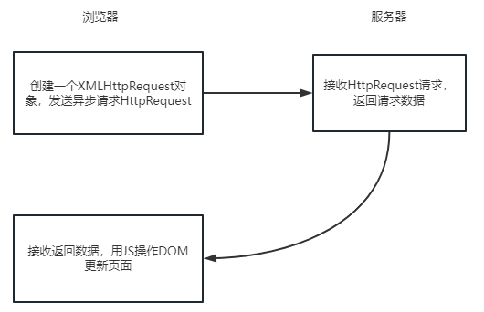

## ajax原理
AJAX全称（Async Javascript and XML）, 是一种创建交互式网页应用的网页开发技术，可以在不在重新加载整个网页的情况下，与服务器交换数据，并且更新部分网页

> 原理：通过XmlHttpRequest对象来向服务器发异步请求，从服务器获取数据，然后用JavaScript来操作Dom而更新页面



例子:
领导想找小A汇报工作，委托了自己的小秘去联系小A，自己就做自己的事情，直到小秘告诉领导，小A已经到了。领导就停止工作，进行和小A的汇报工作

在例子当中，领导就是浏览器、小秘就是XMLHttpRequest对象、小A就是响应的数据。在响应数据到来之前，浏览器可以继续做其他的事情。

### 实现过程
- 1.创建Ajax的核心对象XMLHttpRequest对象
- 2.通过XMLHttpRequest对象的open()方法与服务端建立链接
- 3.构造请求所需得数据内容，并通过XMLHttpRequest()对象得send()方法发送给服务端
- 4.通过XMLHttpRequest对象提供onreadystatechange事件监听服务器端你的通信状态
- 5.接受并处理服务端向客户端响应得数据结果
- 6.将处理结果更新到HTML页面中


1. 创建Ajax的核心对象XMLHttpRequest对象
   ```js
   const xhr = new XMLHttpRequest() // 初始化 XMLHttpRequest 实例对象
   ```
2. 通过open方法与服务器建立链接
   ```js
   xhr.open(method,url,[async],[user],[password])
   
   <!-- 
   method: 当前的请求方式，常见的有GET\POST
   url: 服务端地址
   async：布尔值,表示是否异步执行操作，默认为true
   user：可选用户名用于认证用途，默认null
   password：可选密码用于验证用途，默认null 
   -->
   ```
3. 通过send方法给服务端发送数据
   ```js
   xhr.send([body])

   <!-- 
   body:在XHR请求中要发送的数据体，如果不传递数据则为null,
   如果使用 GET 请求发送数据，注意
   1. 将请求数据添加到open()方法中的url地址中
   2. 发送请求数据中的send()方法中参数设置为null
   -->
   ```
4. 绑定onreadystatechange事件
   - onreadystatechange事件用于监听服务器端的通信状态，主要监听的属性为XMLHttpRequest.readyState
   XMLHttpRequest.readyState属性的5种状态

    | 值  | 状态                           | 描述                                       |
    | --- | ------------------------------ | ------------------------------------------ |
    | 0   | UNSENT(未打开)                 | open方法还未被调用                         |
    | 1   | OPENED(未发送)                 | send方法还未被调用                         |
    | 2   | HEADERS_RECEIVED(以获取响应头) | send方法已经被调用，响应头和状态已经返回   |
    | 3   | LOADING(正在下载响应体)        | 响应体下载中，responseText中已获取部分数据 |
    | 4   | DONE(请求完成)                 | 整个请求过程已完毕                         |

    - 只要readyState属性值一变化，就会触发readystatechange事件
    - XMLHttpRequest.responseText属性用于接收服务器端的响应结果
  
##### 示例：
```js
const request = new XMLHttpRequest()
request.onreadystatechange = function(e){
    if(request.readyState === 4){  // 整个请求过程完毕
        if(request.status >= 200 && request.status <= 300){
            console.log(request.responseText) // 服务端返回的结果
        }else if(request.status >= 400){
            console.log("错误信息：", request.status)
        }
    }
}
request.open('POST','http://xxxx')
request.send()
```

##### 封装ajax请求
```js
function ajax(options){
    // 创建XMLHttpRequest对象
    const xhr = new XMLHttpRequest()

    // 初始化参数内容
    options = options || {}
    options.type = (options.type || 'GET').toUpperCase()
    options.dataType = options.dataType || 'json'
    const params = options.data

    // 发送请求
    if(options.type === 'GET'){
        xhr.open('GET',options.url+'?'+params,true)
        xhr.send(null)
    }else if(option.type === 'POST'){
        xhr.open('POST',options.url,true)
        xhr.send(params)
    }

    // 接收请求
    xhr.onreadystatechange = function(){
        if(xhr.readyState === 4){
            let status = xhr.status
            if(status >= 200 && status < 300){
                options.success && options.success(xhr.responseText,xhr.responseXML)
            }else {
                option.fail && option.fail(status)
            }
        }
    }
}
```

使用
```js
ajax({
    type:'post',
    dataType:'json',
    data:{},
    url:'https://xxx',
    success: function(text,xml){
        // 请求成功的回调函数
    },
    fail:function(status){
        // 请求失败的回调函数
    }
})
```