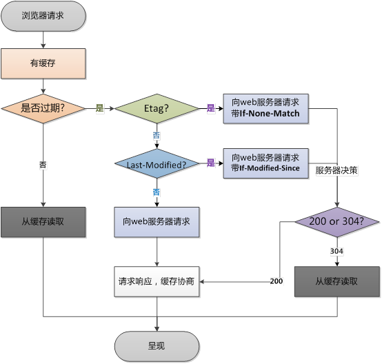

## 常见请求头
> 请求头（HTTP header fields），是指在超文本传输协议（HTTP）的请求和响应头的那部分内容，其定义了一个超文本传输协议事务的操作参数

### 分类
| 字段名            | 说明                                       | 示例                                           |
| ----------------- | ------------------------------------------ | ---------------------------------------------- |
| Accept            | 回应内容类型                               | Accept： application/json,text/javascript      |
| Accept-Charset    | 接受的字符集                               | Accept-Charset：utf-8                          |
| Accept-Encoding   | 编码方式列表                               | Accept-Encoding：gzip,deflate                  |
| Accept-Language   | 回应内容的自然语言列表                     | Accept-Language:zh-CN,en-US                    |
| Authorization     | 用于超文本传输协议的认证信息               | Authorization:BasicQAXKCxiKDJAD...==           |
| Cache-Control     | 缓存机制指令                               | Cache-Control:no-cache                         |
| Connection        | 优先使用的连接类型                         | Connection:keep-alive; Connection:Upgrade      |
| Cookie            | 超文本传输协议                             | 对应Application-Cookie                         |
| Content-Length    | 以八位字节数组表示请求体的长度             | Content-Length:348                             |
| Content-Type      | 请求体的多媒体类型                         | Content-Type:application/x-www-form-urlencoded |
| Date              | 发送的日期和时间                           | Date: Mon, 22 Jan 2024 02:02:50 GM             |
| Expect            | 客户端要求服务端做出的特定行为             | Expect:100-continue                            |
| Host              | 服务器域名以及协议端口号                   | Host:www.baidu.com                             |
| If-Match          | 客户端提供实体是否和服务器上的实体对应     | If-Match:"94545454...."                        |
| If-Modified-Since | 允许对应的内容未被修改情况下返回 304未修改 | If-Modified-Since:Mon, 22 Jan 2024 02:02:50 GM |
| If-Node-Match     | 允许对应的内容未被修改情况下返回 304未修改 | If-Node-Match :"94545454...."                  |
| If-Range          | 如果实体未被修改，仅发送修改的那一个       | If-Range :"94545454...."                       |
| Range             | 仅请求某个实体的一部分                     | Range:bytes=500-999                            |
| User-Agent        | 浏览器的身份标识字符串                     | User-Agent:Mozilla/5.0                         |
| Origin            | 针对 跨域请求                              | Origin: https://oa.meda.aa                     |

---

> 浏览器缓存：是浏览器在本地磁盘对用户最近请求过的文档进行存储，当访问者再次访问同一页面时，浏览器直接从本地磁盘加载文档

- 浏览器缓存优点：减少多余的数据传输，减少了服务器的负担，提升网站效率，加快网站速度

- 浏览器缓存主要有2种，协商缓存和强缓存
- 强缓存：不会向服务器发送请求、直接从缓存中读取资源，请求返回200状态码展示
- 协商缓存：向服务器发送请求，服务器会根据request header的参数判断是否命中协商缓存，如果命中，则304状态码带上新的去缓存中读取资源

- **共同点**：都是从客户端缓存中读取资源，**区别**：强缓存不会发请求，协商缓存会发请求

### 浏览器缓存过程
1. 浏览器第一次加载资源，服务器返回200，浏览器将资源文件从服务器上请求下载下来，并把 **response header**及该请求的返回时间一并缓存
2. 下一次加载资源时，先比较当前时间和上次返回的200时间差，如果没有超过**cache-control设置的max-age**，则没有过期，命中强缓存，不发请求直接从本地缓存中读取该文件（如果浏览器不支持HTTP1.1，则用expires判断是否过期）；如果时间过期，则向服务器发送携带 **If-None-Match和If-Modified-Since**的请求
3. 服务器收到请求后，优先根据Etag的值判断被请求的文件有没有做好修改，**Etag值一致没有修改，命名协商缓存，返回304**，如果不一致，直接返回新的资源文件带上新的Etag值并返回200
4. 如果服务器收到请求没有Etag值，则**将If-Modified-Since和被请求文件的最后修改时间做比对，一致则命中协商缓存，返回304**； 不一致则返回新的last-modified和文件并返回200

---
### 使用场景
#### 协商缓存
> 协商缓存是利用 **Last-Modified**， **If-Modified-Since**， **ETag**，**If-None-Match** 这两对请求头响应管理

- Last-Modified：本地文件最后修改日期，If-Modified-Since：上次返回的Last-Modified的值，询问服务器在该日期后资源是否能更新，有更新的话就会将新的资源发送过来
- Etag：像指纹，资源变化都会导致ETag变化，保证每一个资源都是唯一的
- If-None-Match：会将上次返回的Etag发送给服务器，询问该资源是否有更新，有变动就会发送新的资源

- 客户端向服务端发送带有**If-None-Match和If-Modified-Since**的请求进行协商判断，如果资源没有变化继续使用本地缓存，记录为304状态；如果资源发生变化，服务端响应数据，记录为200状态

#### 强制缓存
> 强制缓存时不需要发送请求到服务断的，根据请求头 **expires** 和 **cache-control** 判断是否命中强缓存，

- 如果在 **expires** 内，就直接从缓存读取，不会像服务器发送请求，展示为200

---

### Cookie
- cookie为 小型文本文件，指 某些网站为了辨别用户身份而存储在用户本地终端上的数据，通过响应头set-cookie决定
- 一段一般不超过4KB的小型文本数据，它是由一个名称（Name）、一个值（Value）和其他几个用于控制Cookie有效期、安全性、使用范围的可选属性组成
   
- Cookie主要用于以下三个方面
1. 会话状态管理（如 用户登录状态、购物车、游戏分数或其他记录的信息）
2. 个性化设置（如 用户自定义设置、主题等）
3. 浏览器行为跟踪（如 跟踪分析用户行为等）