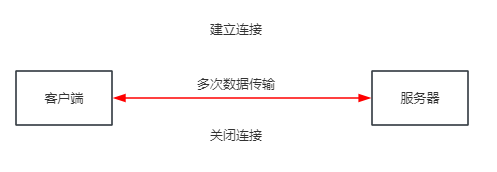

## HTTP1.0/1.1/2.0
### HTTP1.0
> HTTP协议的第二个版本，第一个在通讯中指定版本号的HTTP协议版本

HTTP1.0浏览器与服务器只保持短暂的连接，每次请求都需要与服务器建立一个TCP连接，服务器处理完成后立即断开TCP连接，服务器不跟踪每个客户也不记录过去的请求。 就是 **每次与服务器交互，都需要新开一个连接**

所以在交互时，需要多次建立连接、数据传输、关闭连接，这明显造成了性能上的缺陷，如果建立长连接，则需要设置一个Connection字段，Connection：keep-alive

---

### HTTP1.1
HTTP1.1中，默认支持长连接（Connection： keep-alive），即在一个TCP连接上可以传送多干活HTTP请求和响应，减少建立和关闭连接的消耗和延迟。即 **建立一次连接，可以多次传送数据**

同样HTTP1.1还允许客户端不用等待上一次请求结果返回，就可以发出下一次请求了。但服务器端必须按照先后顺序依次返回数据。这种方式大大减少了整个下载课程所需要的时间

- 同时，新增了很多请求头和响应头来完善功能
1. 引入更多的缓存控制策略，如If-Unmodified-Since，If-Match，If-None-Match等缓存头来控制缓存策略
2. 引入range，允许值请求资源某个部分
3. 引入host，实现了一台WEB服务器上可以在同一个IP地址和端口号上使用不同的主机名来创建多个虚拟web站点
4. 添加了其他请求方式： put、delete、options...

---

### HTTP2.0
- 新增特性
1. 多路复用
2. 二进制分帧
3. 首部压缩
4. 服务器推送

#### 1. 多路复用
> 客户端和浏览器都可以同时发送多个请求或回应，而且不用按顺序一一对应，这就避免了"队头堵塞"

- 同时请求css、js资源同时发送到服务器

#### 2. 二进制分帧
> 帧是HTTP2中最小的通信单位

- 高效解析，HTTP2 采用二进制格式传输数据，而非 HTTP 1.x 的文本格式
  - 会将请求和响应数据分割成更小的帧，并且它们采用二进制编码
- HTTP2，同域名的所有通信都在单个连接上完成，该连接可以承载任意数量的双向数据流
  - 每个数据流都以消息的形式发送，而消息又由一个或多个帧组成
  - 多个帧之间可以乱序发送，跟着帧首部的流标识可以重新组装，也是多路复用同时发送数据的实现条件

#### 3. 首部压缩
> HTTP2在客户端和服务器端使用 **首部表**来跟踪和存储之前发送的键值对，对于相同的数据，不再通过每次请求和响应发送

- 首部表在HTTP2的连接存续期间始终存在，由客户端和服务端共同渐进的更新
  就请求1中发送了所有的头部字段信息，第二次请求时，只需要发送差异的数据信息，这就可以减少多余操作，减低开销

#### 4.服务器推送
> HTTP2引入服务器推送，允许服务端推送资源给客户端

- 服务器会顺便把一些客户端需要的资源一起推送到客户端，如在响应一个页面请求当中，就可以随同页面的其他资源。假如客户端只请求html资源，服务端有可能把html和css资源一起推送过去，节省了客户端再次创建链接发送请求到服务器端获取。这种方式适合 **加载静态资源**
  

---
## 总结
- HTTP1.0：
  1. 每次请求都需要建立一个新的TCP链接，浏览器和服务器只保存短暂的链接，浪费服务器资源

- HTTP1.1：
  1. 引入持久连接，即TCP连接默认不关闭，可以被多个请求复用
  2. 同一个TCP，客户端可发送多个请求
  3. 虽然允许复用TCP链接，但是同一个TCP链接里面，所有的数据通信是按次序进行，服务器只有处理完一  请求，才会接着处理下一个请求。如果有堵塞，后面请求就会进行排队处理
  4. 新增了一些请求方法： PUT\DELETE
  5. 新增了一些请求头部、响应头信息：If-Unmodified-Since，If-Match，If-None-Match

- HTTP2.0:
  1. 采用二进制格式而非文本格式
  2. 完全多路复用，而非有序并阻塞的、只需一个连接即可实现并行
  3. 使用报头压缩，降低开销
  4. 服务器推送
